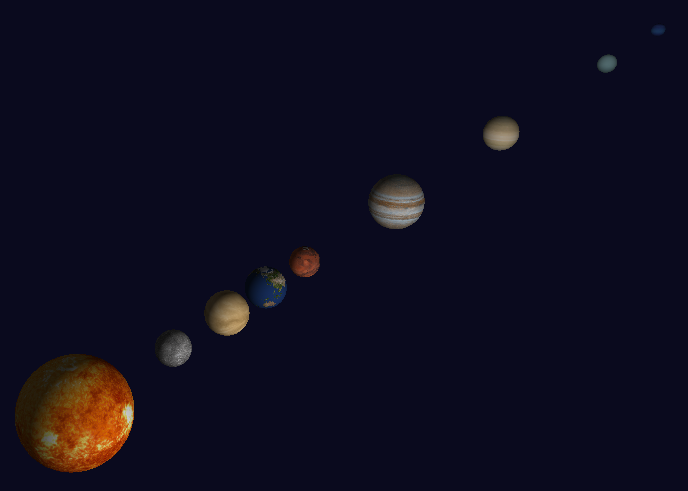
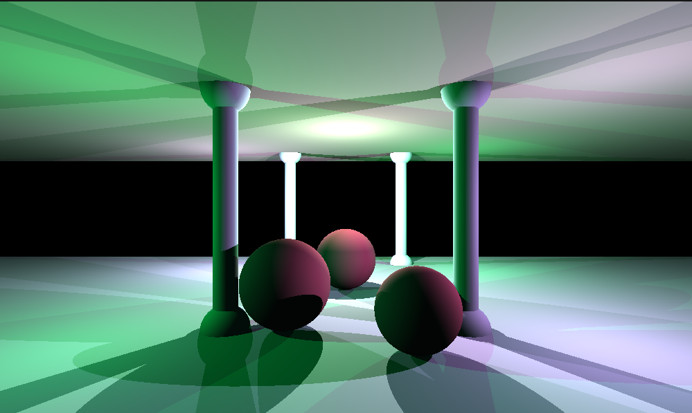
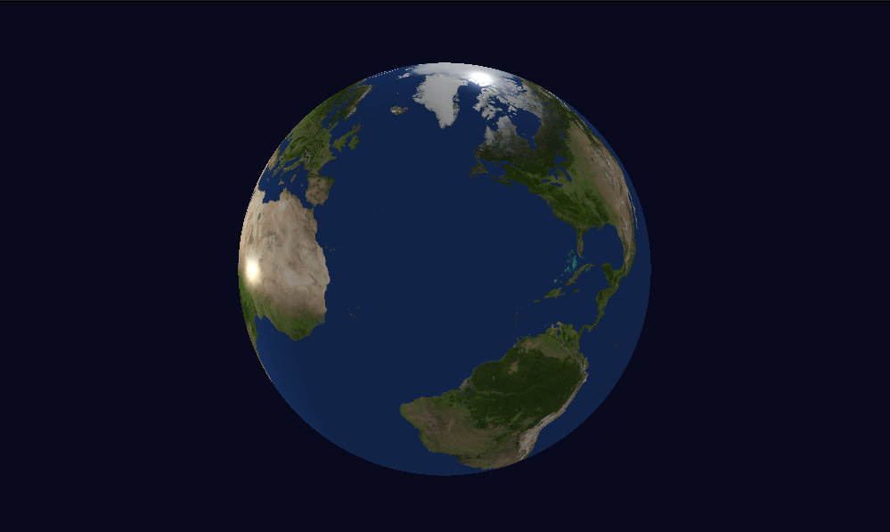
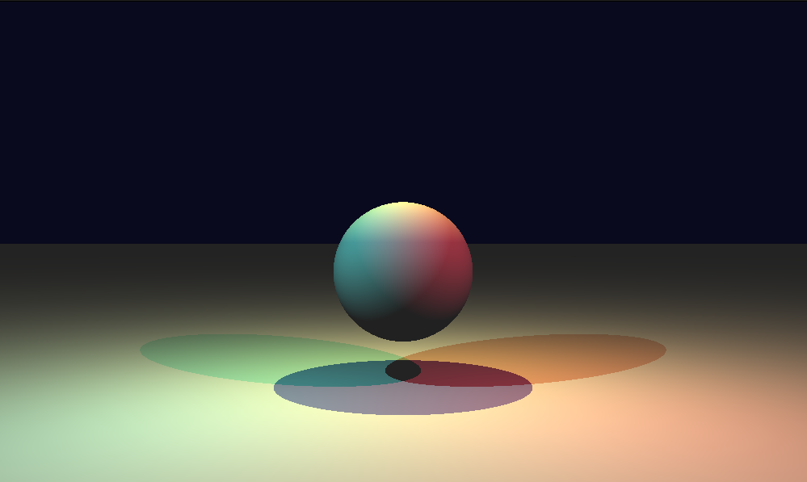

# miniRT

A small educational ray tracer written in C that parses simple scene files and renders images using the MLX (X11) library.

**Project**: A minimal ray tracer supporting spheres, planes, cylinders, cones, lights, textures and a basic Blinn-Phong lighting model.

**Features:**
- **Scene parsing**: Read `.rt` scene files from the `maps/` directory.
- **Ray tracing**: Per-pixel ray generation and intersection routines for common primitives.
- **Materials & lighting**: Ambient, diffuse and specular calculations (Blinn-Phong).
- **Textures**: Basic texture loading and mapping routines.
- **Live preview**: Rendered output displayed using the MLX windowing library.

**Requirements**
- Linux with X11 development libraries (for MLX).
- A C compiler supporting `cc`.
- `make` for the provided build system.

**Build**
1. From the repository root, build everything with:

```
make
```

2. The default target builds dependencies (`libft`, `gnl`, `mlx`) and links the executable `miniRT`.

See the build configuration in [Makefile](Makefile).

**Usage**
- Basic: `./miniRT <scene.rt>`

Example:

```
./miniRT maps/one.rt
```

`srcs/main.c` expects a single scene file argument; the program initializes the scene, parses the file, loads textures, generates rays and starts the MLX render loop.

**Clone & Install (example)**
- Clone the repository:

```
git clone --recurse-submodules https://github.com/mansargs/RayTracer-MiniRT.git miniRT
cd miniRT
```

- Install platform dependencies (Debian/Ubuntu example):

```bash
sudo apt update
sudo apt install build-essential libx11-dev libxext-dev libxrandr-dev libpthread-stubs0-dev
```

Note: MLX requires X11 development headers; adapt the package names for other distros.

**Build**
- Build the project with `make` (this will also build `libft`, `gnl` and the local `mlx`):

```
make
```

The resulting executable is `miniRT`.

**Run**
- Start the renderer with a scene file:

```
./miniRT maps/one.rt
```

**Keyboard Controls**
- `ESC` : Exit the application.
- `SPACE` : Cycle through cameras in the scene.
- `W` / `A` / `S` / `D` : Move the active camera forward / left / backward / right.
- Arrow keys `←` `→` `↑` `↓` : Rotate the active camera (yaw / pitch).
- `R` : Activate checkerboard (no texture / bump).
- `T` : Toggle texture mapping (only when textures are loaded in the scene).
- `B` : Toggle bump mapping (only when bump maps are loaded in the scene).

**Mouse Controls**
- Left click (`MOUSE_LEFT`) or right click (`MOUSE_RIGHT`) on the rendered image will toggle the checkerboard state for the clicked object when checkerboard mode is enabled.

**Screenshots / Images**
- Put screenshots or example renders in the `img/` folder. The repository includes a small `img/` stub.

**Gallery**
Below are example renders — replace these files in `img/` with your own screenshots (`img/img1.png`, `img/img2.png`, `img/img3.png`, `img/img4.png`):

<p align="center">
	
	
	
	
</p>

- To add or replace images, put files in the `img/` directory and commit them. For large images, consider using Git LFS.

**Scene files and examples**
- Example scenes live in the `maps/` folder. There is also an `invalid_maps/` folder containing test cases for parser error handling.

**Repository layout**
- `srcs/` : application source code (parsing, ray tracing, drawing, utils)
- `hdrs/` : public headers
- `maps/` : sample scene files and `textures/`
- `libraries/` : vendored `libft`, `gnl`, and `mlx` used by the project

**Development notes**
- The project builds `libft`, `gnl`, and a local copy of `mlx` automatically via the `Makefile` targets.
- Compilation flags are defined in `Makefile` and include `-Wall -Wextra -Werror`.

**Contributing**
- Open issues or pull requests with focused changes. If you add features, please include an example scene in `maps/` and update this README.

**License**
- No license specified in this repository. Add a `LICENSE` file if you want to set terms for reuse.

---

If you'd like, I can:
- add a short example scene and a screenshot,
- add a `Makefile` target to export a rendered image to an image file,
- or extend this README with a short developer guide.
